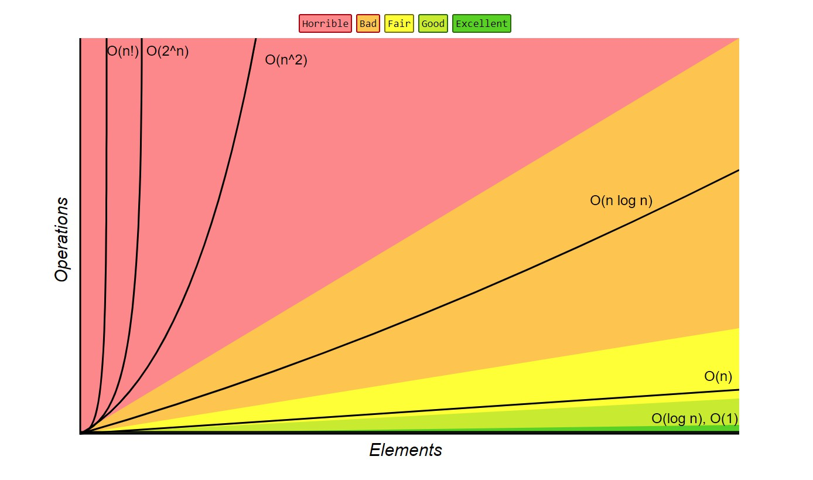

# 大 O 表示法

## 概念

大O表示法就是将算法的所有步骤转换为代数项，然后排除不会对问题的整体复杂度产生较大影响的较低阶常数和系数。简而言之：我们只关注表达式中对表达式最终结果会产生最大影响的因子。（当常数非常大而n很小的时候并不是这样的，但是我们现在不要担心这种情况）。

## 示例
```shell
规律          Big-O

2             O(1)   --> 一个常数

2n + 10       O(n)   --> n 对整体结果会产生最大影响

5n^2         O(n^2) --> n^2 具有最大影响
```

```python

# ①
a = 5
b = 6
c = 10

# ②
for i in range(n):
    for j in range(n):
        x = i * i
        y = j * j
        z = i * j
        
# ③
for k in range(n):
    w = a * k + 45
    v = b * b
    
# ④
d = 33
```
任务操作总数分为四项。
第一项是常数 `3`，代表程序开头的三个赋值语句。
第二项是 `3n²`，因为嵌套迭代（循环结构）中有三个赋值语句分别被重复执行了 `n²` 次。
第三项是 `2n`，表示两个赋值语句被重复执行了 `n` 次。
最后一项是常数 `1`，代表最后的赋值语句。
我们得到 `T(n) = 3 + 3n² + 2n + 1 = 3n² + 2n + 4`。看到指数项，我们自然地发现 `n²`项占主导，当 `n` 增大时，其他项和主导项的系数都可以忽略，所以这个代码片段的数量级就是 `O(n²)`。

## 常用函数阶

| 符号         | 函数名称                             |           举例|
| -------------- | ---------------------------------------- | --- |
| O(1)           | 常数（阶，下同）                 |   变量赋值  |
| O(log n)       | 对数                                   |   二分搜索   |
| O(n)           | 线性函数                             |线性搜索|
| O(n log n)     | 线性对数函数，或对数线性、拟线性、超线性 |快速排序|
| O(n^2)         | 二次函数,平方                      | 选择排序  |
| O(n^c),整数c>1 | 多项式，有时叫作“代数”（阶） | 嵌套循环 |
| O(c^n)         | 指数函数，有时叫作“几何”（阶） | #TODO  |
| O(n!)          | 阶乘，有时叫做“组合”（阶） | 旅行商问题 |

### 关于`阶`

若存在常量k和n0,使算法A在解决规模n>=n0的问题时，需要的问题单元不大于k*f(n),则算法A为f(n)阶，表示为O(f(n))。
O(f(n))定义中的条件n>=n0正式阐明了问题规模足够大的概念，一般地，有很多k和n值可以满足这个定义。大O表示法的几个数学属性有助于简化算法分析。在讨论这些属性是要记住，O(f(n))意为f(n)阶，O并不是一个函数。
- 可忽略算法增率函数的低阶项。
- 可忽略算法增率函数中高阶项的倍数常量。
- O(f(n))+O(g(n))=O(f(n)+g(n))可组合增率函数。

**注意**

根据定义，对于任意一个 g(n) 函数来说，可能存在很多个函数f (n)，使得f (n)=O(g(n))，即O(g(n))表示的实际上是一个函数的集合，这里的等于也不是普通意义上的等于，而是说明f (n)是函数集合o(g(n))里的一员，即f (n)=O(g(n))并不意味着f (n)等于O(g(n))。等于号的这种使用令那些严谨的科学家非常不快甚至愤怒，但计算机界人士很喜欢这种模糊的表示。不过，我们在心里应该知道，f (n)=O(g(n))并不意味着f (n)≠O(g(n))。

## 常见大 O 函数的图像



根据图表，我们可以直观地得到几种算法的复杂度关系：

c < log n < n < n * log n < n^2 < n^3 < 2^n < 3^n < n!

## 常见排序算法复杂度

| 算法                     | 时间复杂度 |         -       |      -          | 空间复杂度 |
| -------------------------- | ----------- | -------------- | -------------- | ---------- |
|                            | 最好      | 平均         | 最差         | 最差     |
| 快速排序（Quicksort）  | Ω(n log(n)) | Θ(n log(n))   | O(n^2)         | O(log(n))  |
| 归并排序（Mergesort） | Ω(n log(n)) | Θ(n log(n))   | O(n log(n))    | O(n)       |
| Timsort                    | Ω(n)       | Θ(n log(n))   | O(n log(n))    | O(n)       |
| 堆排序（Heapsort）    | Ω(n log(n)) | Θ(n log(n))   | O(n log(n))    | O(1)       |
| 冒泡排序（Bubble Sort） | Ω(n)       | Θ(n^2)        | O(n^2)         | O(1)       |
| 插入排序（Insertion Sort） | Ω(n)       | Θ(n^2)        | O(n^2)         | O(1)       |
| 选择排序（Selection Sort） | Ω(n^2)     | Θ(n^2)        | O(n^2)         | O(1)       |
| 数排序（Tree Sort）   | Ω(n log(n)) | Θ(n log(n))   | O(n^2)         | O(n)       |
| 希尔排序（Shell Sort） | Ω(n log(n)) | Θ(n(log(n))^2) | O(n(log(n))^2) | O(1)       |
| 桶排序（Bucket Sort） | Ω(n+k)     | Θ(n+k)        | O(n^2)         | O(n)       |
| 基数排序（Radix Sort） | Ω(nk)      | Θ(nk)         | O(nk)          | O(n+k)     |
| 计数排序（Counting Sort） | Ω(n+k)     | Θ(n+k)        | O(n+k)         | O(k)       |
| [Cubesort](http://en.wikipedia.org/wiki/Cubesort) | Ω(n)       | Θ(n log(n))   | O(n log(n))    | O(n)       |

关于表格中的表示法，可以参考这篇文章。[算法分析——算法的渐进效率分析 和 渐进符号大O、大Ω、大θ、小o、小ω](https://blog.csdn.net/qq_28382071/article/details/80193541)
## 注意

算法复杂度只是用来描述该算法的复杂度，虽然很多时候我们忽略常量，但是有的时候常亮也可能影响很大。
```python
import time


def foo(n):
    for _ in range(n):
        pass
        
def bar(n):
    for _ in range(n):
        time.sleep(1)
        pass
```
虽然上述两个函数的复杂度均为`O(n)`,但是显然`bar()`更加耗时。具体可参考`《图解算法》- 4.3`章节。

## 更多

[白话算法：时间复杂度和大O表示法](https://www.jianshu.com/p/59d09b9cee58)

[常见算法复杂度-大O小抄](http://bigocheatsheet.com/)