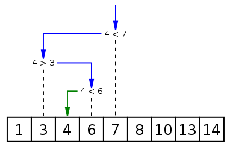

# 线性搜索和二分搜索

## 引言

> 富翁子不识字，人劝以延师训子。先学一字是一画，次二字是二画，次三字三画。其子便欣然投笔告父曰：“儿已都晓字义，何用师为？”父喜之乃谢去。一日父欲招万姓者饮，命子晨起治状，至午不见写成。父往询之，子恚曰：“姓亦多矣，如何偏姓万，自早至今才得五百画哩！”
>
> <right> ——《笑林广记》· 训子（古艳部）</right>  

以上便是`线性查找`，线性查找也叫`简单查找`，或者更加通俗的叫法“傻找”。就是从头找到尾，直到符合条件了才返回。

## 概念

在计算机科学中，`二分搜索`（binary search），也称折半搜索（half-interval search）、对数搜索（logarithmic search），是一种在**有序数组**中查找某一特定元素的搜索算法。搜索过程**从数组的中间元素开始**，如果中间元素正好是要查找的元素，则搜索过程结束；如果某一特定元素大于或者小于中间元素，则在数组大于或小于中间元素的那一半中查找，而且跟开始一样从中间元素开始比较。如果在某一步骤数组为空，则代表找不到。这种搜索算法每一次比较都使搜索范围缩小一半。

## 图示

## 复杂度

O(log(n))

## 扩展

[`bisect`-列表的二等分算法](https://docs.python.org/3.6/library/bisect.html)
